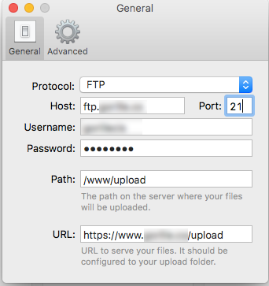
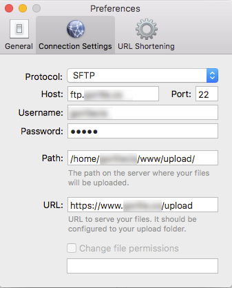

FileShuttle
===========

**FileShuttle** is a little tool to quickly upload files on the Web. It supports FTP, SCP and SFTP.

# use

## configuration

Right click on menubar icon > "Preferences" > "Connection Settings" ("Preferences" > "General" for earlier versions).

### FTP

- Protocol : FTP
- Host : ftp.hostname.com Port: 21
- Username : ftp-username
- Password : *******
- Path : /www/upload
- URL : https://www.hostname.com/upload/

### SFTP

- Protocol : SFTP
- Host : ftp.hostname.com Port: 21
- Username : ftp-username
- Password : *******
- Path : /home/username/www/upload
- URL : https://www.hostname.com/upload/

## upload

- Drag a file from Finder and drop it on the menubar icon.
- Link of uploaded file is copied to clipboard, you can paste it right away (even before upload is completed).

see earlier uploaded files by left-clicking the menubar icon. Click an item will copy the URL corresponding to this already uploaded file to the clipboard.

# version history

Mac OSX 10.10 and above is supported, 10.8 is the minimum known required version however your mileage may vary

Bug fixes for 10.8 and 10.9 will only be supported via Pull Requests on a case by case basis.

Download 3.x-dev **WARNING - Development Version**: Not Yet available as a Built Binary
* **New Feature** - 10.10+ officially supported
* **Cleanup** - Migrated to CocoaPods for dependency management and updated:
  * Sparkle Library
  * **Replaced** EMKeychain with AHKeychain
  * Various Deprecated Methods updated/replaced
  * **Deprecation** - Growl Support formally dropped - Minimum required version is now 10.8
* **TODO** - Proper SSH2 based SFTP support including Public Key support
* **TODO** - AWS S3 Support
* **TODO** - Multiple URL Shortener Options inc Yourls

Download 2.x-dev **WARNING - Development Version**: http://fileshuttle.io/fileshuttle-2.x-dev.zip
* **New Feature** - Option to auto delete screenshot after upload.
* **New Feature** - Notification Center support - Falls back to growl on Pre 10.8
* **New Feature** - Allow for file permission modification after upload with SFTP (no FTP at this stage)
* **Bugfix** - URL shortener fixed by using is.gd - pending rewrite and having multiple choices
* **Bugfix** - Fix display of menu bar icon in fullscreen apps

Download 2.1 : http://fileshuttle.io/fileshuttle-2.1.zip
* **Bugfix** - Auto Screenshot Uploads on Mountain Lion (10.8).
* **Bugfix** - Generated zip files (from app uploads or multiple files) now upload with the correct permissions.
* **New Feature** - You can now choose the file name given when uploaded from within the preferences pane.
* **New Feature** - Sparkle Updater Engine added for automatic updates in future.
* **New Feature** - Retina Menubar Icons.

Download 2.0 : http://fileshuttle.s3.amazonaws.com/FileShuttle.2.0.zip